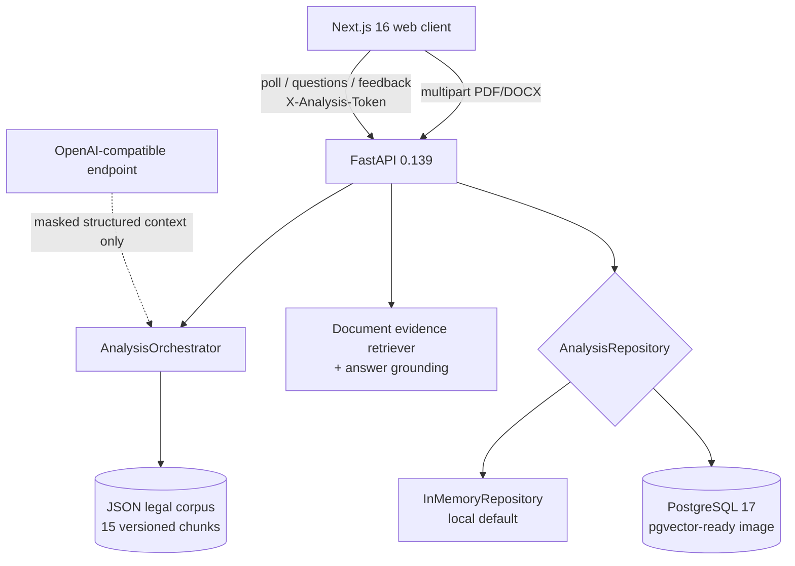
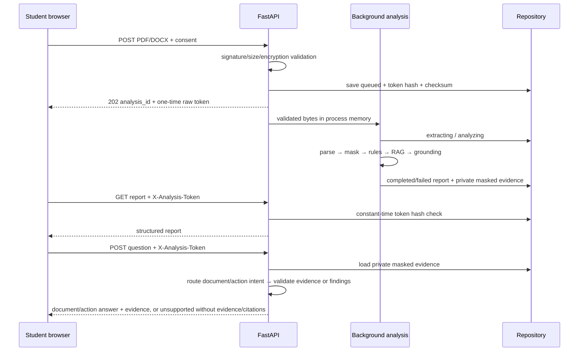

# Архитектура QADAM AI

## Системный контекст

Frontend и backend отделены стабильным JSON/OpenAPI контрактом. Веб не получает доступ к базе,
а backend не доверяет MIME/расширению браузера и повторно проверяет сигнатуру файла.

## Backend modules

| Слой | Путь | Ответственность |
|---|---|---|
| Transport | `apps/api/src/qadam_api/api` | routes, DI, CORS, RFC 9457-style errors, private token |
| Domain | `apps/api/src/qadam_api/domain.py` | Pydantic enums/models/invariants |
| Documents | `documents/` | validation, PDF/DOCX parsing, OCR gate, language, privacy |
| Analysis | `analysis/` | clause extraction, rules, legal grounding, contextual questions and document/action Q&A |
| Legal | `legal/` | corpus loader, hybrid retriever, reranker |
| Providers | `providers/` | deterministic embeddings/explanations, OpenAI-compatible adapter |
| Persistence | `repositories/` | protocol, memory adapter, SQLAlchemy PostgreSQL adapter |

`AnalysisRepository` не позволяет routes зависеть от конкретной базы. Background task сохраняет
переходы состояния; PostgreSQL adapter использует idempotent merge/upsert, поэтому один analysis ID
обновляется от `queued` до финального отчёта.

## Request and data lifecycle

Сырые bytes не попадают в repository. `documents` хранит SHA-256 и `evidence_json` только с
маскированными блоками и source location. Clause text, записанный в report, тоже уже прошёл
masking. Полный evidence-массив не входит в polling response. Access token хранится как SHA-256, сравнивается через
`secrets.compare_digest`; неверная пара ID/token возвращает одинаковый 404.

## PostgreSQL schema

| Таблица | Назначение |
|---|---|
| `analyses` | lifecycle, language, token hash, JSON report |
| `documents` | checksum и private masked evidence JSON, без сырого файла |
| `clauses` | маскированные извлечённые условия |
| `findings` | severity/category/structured finding |
| `legal_chunks` | подготовлено для persisted corpus/vector deployment |
| `retrieval_logs` | подготовлено для offline evaluation/audit |
| `questions` | маскированный вопрос и режим `document`/`action`/`unsupported`, без ответа/evidence payload |
| `feedback` | rating 1–5 и optional comment |

Для online demo corpus/embeddings загружаются из версионированного JSON в память. Образ PostgreSQL
содержит pgvector для следующей итерации; текущий deterministic embedding не требует extension.

## Надёжность

- При отсутствии LLM key deterministic provider формирует полный отчёт; demo не зависит от сети.
- Timeout/schema/citation violation внешнего provider переключает на deterministic fallback.
- `document` Q&A provider не может сослаться на block ID вне retrieved allow-list или добавить
  неподтверждённое число; при сбое используется дословный маскированный фрагмент.
- `action` Q&A выбирает только уже заземлённые findings, возвращает их точные IDs и clause evidence;
  route не находит опоры — endpoint отвечает `unsupported` без evidence/citations.
- Scan-like PDF возвращает recoverable `ocr_required`, не вызывает provider.
- Неожиданное исключение background pipeline превращается в pollable `failed/internal_error`; путь и
  raw exception не возвращаются пользователю.
- Docker healthchecks: PostgreSQL readiness → API `/healthz` → web root.
- Playwright проверяет четыре полных пути с настоящими synthetic PDF и PostgreSQL, включая RU-вопрос
  к казахскому условию об аренде и action answer по уже найденным рискам.

## Известные production gaps

Это hackathon MVP, поэтому до реального запуска нужны object storage policy, retention worker,
rate limiting, observability/trace IDs, secrets manager, DB migrations runner, malware scanning,
OCR queue, human legal review corpus и независимый security review.
